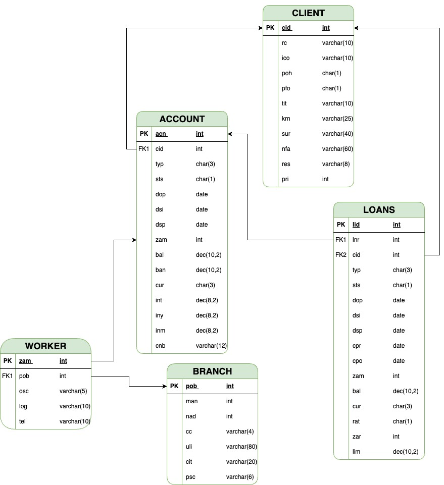

# Datový model pro reporting pro pobočkovou síť

## Vypracoval: David Müller

Tento datový model byl naržen tak aby sledoval a reportoval aktuální i historické údaje o účtech, půjčkách, klientech, zaměstanancích a pobočkách. V modelu je zahrnuto 5 tabulek: ACCOUNTS, LOANS, CLIENT, WORKER a BRANCH.



Každá tabulka musí obsahovat minimálně jeden sloupec, který bude unikátní a nebude nulový (NOT NULL) - Bude mít takzavaně primírní klíč

Primární klíče jsem zvolil následující:

- Tabulka ACCOUNTS - sloupec acn - číslo účtu musí být unikátní
- Tabulka LOANS -  vytvořil jsem nový sloupec lid - Id půjčky, který bude zajišťovat, že každý záznam bude unikátní. Teoreticky by se mohlo stát, že bude existovat více záznamů LOANS se stejným číslem účtu.
- Tabulka CLIENT - sloupec cid - id klienta
- Tabulka BRANCH - sloupec pob - id pobočky
- Tabulka WORKER - sloupec zam - id zaměstance

Dále zde popisuji také vazby mezi jednotlivými tabulkami. V praxi se tyto vazby realizují pomocí takzvaných cizích klíčů. Cizí klíče (foregin key) zajišťují integritu dat. Principiálně se odkazují na primární klíče v jiné tabulce a zajišťují tak vzájemné propojení.

Cizí klíče jsou následující:

- Id klienta v tabluce ACCOUNTS odkazuje na id klienta v tabulce CLIENT - Zajistí, že bude účet klienta přiřazen existujícímu klientovi
- Číslo účtu v tabulce LOANS odkazuje na číslo účtu v tabulce ACCOUNTS - Zajistí, že půjčka odpovídá příslušnému účtu
- Id klienta v tabluce LOANS odkazuje na id klienta v tabulce CLIENT - To zajistí, že úvěr odpovídá příslušnému klientovi (teoreticky to není nutné, protože odkaz už je vytvořen přes číslo účtu)
- Id zaměstanace v Tabulce WORKER odkazuje na id zaměstanace, který účet založil v tabulce ACCOUNT - Zajistí, že zaměstnanec bude odpovídat příslušnému účtu, který založil
- Id pobočky v tabulce WORKER Odkazuje na id pobočky v tabulce BRANCH. -  Zajistí, že každý zaměstnanec je přiřazen příslušné pobočce.

Z jednostlivých tabulek si lze snadno vyfiltrovat požadovaná data. Zde je ukázka toho, jak například získat přehled nově prodaných produktů v členění dle zaměstananců (lze použít následující zjednodušený SELECT s využitím UNION příkazu):

```sql
SELECT
    acn AS product_id
FROM
    ACCOUNTS
WHERE
    zam = @konkretni_zam

UNION ALL

SELECT
    lid AS product_id
FROM
    LOANS
WHERE
   zam = @konkretni_zam

ORDER BY product_id
```

Pro zajištění možnosti reportovat data zpětně lze využít koncept tzv. dočasných tabulek (temporal tables). Dočasné tabulky mohou zvýšit velikost databáze více než běžné tabulky, zejména pokud uchovávávají historická data po delší dobu. Zásady uchovávání historických dat jsou proto důležitým aspektem plánování a správy životního cyklu každé dočasné tabulky. Pro vytváření dočsných tabulek lze využít službu Azure SQL Database, která umožňuje zadat dobu uchovávání.

Pro prezentaci výsledných reportů je vhodné využít nástroje business intelligence (BI) - například Power BI od Microsoftu. Lze využít filtrování dat, jak jsem popisoval výše. Požadovaná data si lze ukládat do takzvaných pohledů (VIEW), díky čemuž se s nimi bude lépe pracovat při prezentaci.

Dalším prvkem, který by se ještě hodilo zmínit jsou uložené procedury (STORED PROCEDURES). Jsou to posloupnosti SQL příkazů, které významně usnadní práci s datovým modelem. Například pokud se bude odstraňovat záznam z tabulky klient, je potřeba odtsranit i odpovídající záznam z tabulky ACCOUNTS a LOANS. Toto by ideálně ještě mělo proběhnout transakčně. Transakce ochrání databázi před softwarovou chybou a umožní provést sekvenci příkazů jako jednu nedělitelnou operaci. Pokus se zdaří, je potvrzena příkazem COMMIT, pokud se nezdaří, je databáze vráce do stevu před započetím transakce - to se nazývá ROLLBACK.

# Závěr
Mnou navržený model je navržený tak, aby byl robustní a v případě potřeby snadno rozšiřitelný. Je zde zajištěna vysoká úroveň integrity dat a umožňuje efektivní sledování a analýzu historických i aktuálních údajů. Lze ho využít pro jednorázové i pravidelné reporty pro pobočkovou síť.
